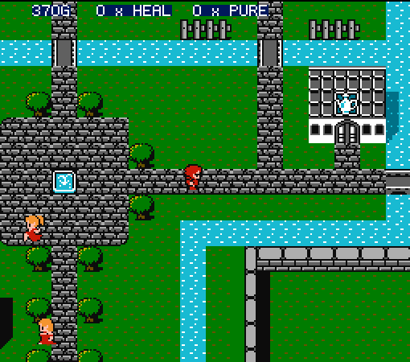
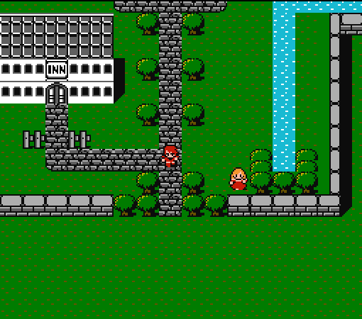
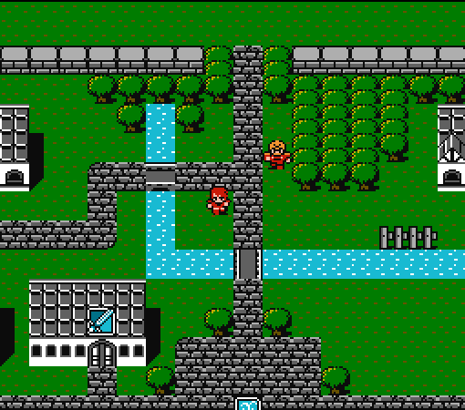

# FCEUX scripts
> Lua scripts for use with FCEUX

## Usage

1. Download and unzip or clone the repository
2. Run scripts by clicking File -> Load Lua Script and browsing to the desired script

## Games

### Final Fantasy

#### hud.lua

Shows a heads-up display at the top of the screen, displaying the player's current gold (`G`), number of `HEAL`s and number of `PURE`s in inventory.

#### buy_heals.lua

Buys as many `HEAL`s as the player can carry or afford.

#### buy_pures.lua

Buys as many `PURE`s as the player can carry or afford.

